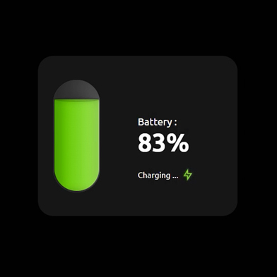

# Day #5

# 🔋 Detect Device Battery

A simple web-based utility that detects and displays the device's battery information using **HTML**, **CSS**, and **JavaScript**.  
It demonstrates the Battery Status API (`navigator.getBattery()`) and updates battery level, charging status, and charging/discharging time in real time with a clean UI and subtle animations.

---

## 🧩 Features

- ✅ Shows current battery level (percentage)
- ⚡ Shows charging status (charging / not charging)
- ⏳ Displays estimated charging or discharging time (if available)
- 🔄 Live updates — listens for battery events and updates UI dynamically
- 🎨 Responsive and minimal UI with animations
- 💻 Works purely on front-end (no backend required)

---

## 🛠️ Technologies Used

- **HTML5** – layout and structure
- **CSS3** – styling and animations
- **JavaScript (ES6)** – Battery API usage and DOM updates

---

# Screenshot
Here we have project screenshot :

